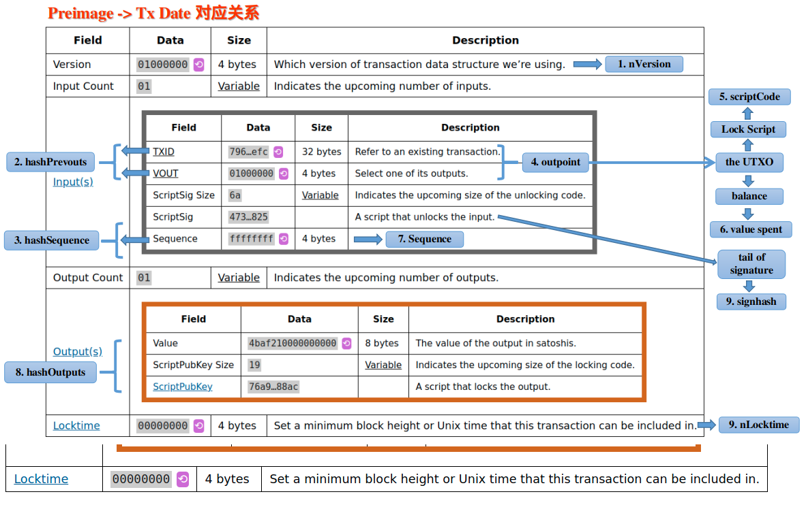

# 使比特币交易具备持续遗传进化能力的一个改进呼吁


本文讲述由一层Token方案引发的比特币改进建议。特别是，其不仅对Token具有重要意义，更对整个比特币网络中的可遗传的交易（TX）的进化能力有关键的影响，所以，题目中讲其“ **使比特币交易具备遗传进化能力** ”。不夸张的说，比特币网络中，所有需要成长变化的数据都将受惠于此改进。

实际上，我很想讲：本文呼吁的改进是实现比特币系统图灵完备能力的必要一环，但比特币的脚本能力确实已经完备了，其完备涵义的前提是：假设我们具有一个无限长的纸带（磁盘与带宽资源）。我确实不能变更这个学界公认的假设前提，但是仍然可以给出一个更准确的表述： **本提议将使比特币脚本的图灵完备能力可以在有限的纸带上具备充分且必要的实用性** 。其充分必要的含义有：接近极限的资源利用率、必不可少的资源回收（数据裁剪）能力，本文后续将解释这一点。

特别是，为获得以上益处， **仅需要一个优雅、简单、一劳永逸的小改进** 。我相信本提议亟需在比特币网络中实现，且一旦得到实施，Bitcoin系统则因具有实用化的图灵完备能力将可以在未来自行的进化发展，将真正不再需要做功能上改进。（类似椭圆曲线加密算法不再安全以后的签名算法改进另当别论）

 **本文希望零技术基础的小白依然能够理解全部流程**，所以简洁的描述了所有必要的基础知识，部分读者可选择性跳过前面的章节（起因赘述、技术基础），但请特别关注文章结尾附近的遗传进化逻辑延伸。** 

## 本文起因

 **一个改进提议的发起，其起因动机经常涉及各种利益关联，我希望完整的讲述其缘由，来表明本改进提议的单纯动机。** 

自2020年9月初，[**sCrypt**](https://scrypt.io/)公司的刘晓辉同学提出了一个[**点对点的一层Token解决方案**](https://xiaohuiliu.medium.com/peer-to-peer-tokens-6508986d9593)。
其仅依赖矿工即可以实现Token的安全交易，具备如下几个关键的应用优点：

 1. 因为不需要第三方的Oracle参与， **使其仅需要最小的信任依赖** 。
 2. 因为不需要第三方的Oracle参与， **使发行Token变得非常简单** ，任何人都可以在自己喜欢的任何钱包中构建一个简单的交易（接近0成本）来创建全局通用的Token。
 3. **兼容SPV**（简易支付验证），可使用Merkle Path简易的验证交易，**是Token可大规模扩容的关键**。

以上三者是同等重要的，为达到快速的推广应用而缺一不可。特别需要提到第2条，其很容易被忽略妥协。ETH Token之所以成功，其重要之处在于其“Token发行的简便性”，这是一层Token的核心竞争力，此特性或许比“去中心信任”更加重要，这使得我认为**此类一层Token是必不可少的**。

但是，开发者们热烈讨论后，发现**此一层Token方案具有交易膨胀问题**，其每一次的Token转移都要携带自Token发行交易始的所有交易的全部数据，随着Token在用户间的持续转移，最终不可避免其体积大小变得不可接受，这是推广实用时不可接受的缺点。

在参与讨论的过程中，[我提出了一种二次Hash的办法](1_txid_new_hash_propose/p2pToken_chat_history.jpeg)来解决这个问题，其需要配合TX版本升级来实现，提议受到邱同学的理解支持。但多数人对一层Token必要性的怀疑以及对协议变更的担忧，而没有考虑到本改进提议的优雅、简洁、一劳永逸、影响巨大等特征，最终我的改进提议并没有得到更多的响应与细细思辨。

部分人希望我写出文字，详细的讲述解决方案，但源于以下因素，一直没有提笔：

- 本技术改进提议非常简单，不需要写文章，只要关心的开发者认真考虑下即可理解。
- 开发者们对可立刻着手构建的二层Token（有讲带Oracle的一层Token）比较感兴趣，并不热情的关心共识版本的变更。
- 一层Token的方案与开发是利他的，自身推动其实现需要消耗精力，其他人使用起来是平等简单的。
- **我的参与完全出于业余爱好，没有任何改行至区块链产业的近远期计划，在家庭与工作繁忙的情况下动力不足。** 
- 本人对Token生态并不是特别的关心，其是很重要的热点，但与我着重思考的一种应用生态方案关联不大。
- 只要给些时间，其他人会发现二层Token的问题，就会自然的重发现（发明）本文提议的方法，并非必须由我来推动。

但是半年过去了，我越发坐不住了，原因多方面如下：

- 近半年一层Token的极少进展与此瓶颈对热点应用的限制，影响了BitcoinSV的发展，也就影响了我对比特币改变民众生活的远景信心，难以忍受现状。
- 蒋杰团队针对一层Token的改进提议应该没有本提议简洁与优雅（欢迎质疑）
- Token热点是事实，在其他区块链在性能问题上出现系统性无解时，比特币系统亟需抓住机会，展示问题解决能力。此时机越发紧张，因为，当大多数圈内参与者被迫接受ETH二层Token后，即便一层Token更具便利性，也难以让已经付出巨大成本的开发者再次迁移。
- 原计划在假期写出来，奈何拖到假期末。但是，拖延不能变成食言。
- 虽然提议对开发者是非常简单的，但希望写一篇不需要基础知识的文章，让不做开发的人也能理解这个改进的**简单并重要**之处，一起推动它的实施。

所以愿意通过本文尽可能的呼吁此改进提议，希望它得到实施。


## 技术基础知识

我们开始一点点拨开技术的迷雾，理解比特币的一层Token智能合约并不困难。

在讲一层Token之前，我们需要先首先讲一下比特币的智能合约的核心概念 OP_PUSH_TX。

而在此之前，我们还需要讲一点点比特币的脚本运行原理。

因此，以下倒叙展开，相信我，这些都很简单，只是为使0基础的技术小白也能看懂，赘述了所有必要的知识，因此篇幅稍长一些，但每一小段都很简单，所需能力仅为注意力的集中。**仅集中注意力一个小时，就可以完成技术的入门，并直达前沿，不再混沌，这会很超值**。


### 比特币脚本程序的运行方式

当前的比特币脚本，通常是长度很短的一些代码，且不像传统高级程序语言那般具有很复杂的跳转结构，而是顺序的执行，如同一个数学算式一般，并不复杂，反而比一般的计算机程序更简单易读。

以最简单的数学算式： `1 + 1` 为例，其在比特币脚本中，表达顺序变为 `1 1 +` ，我们可以将 `+` 理解为一种最简单的函数，其在比特币脚本术语中称为操作符（OP_CODE）。因为操作符有很多，为方便识别，`+` 在比特币脚本中以 `OP_ADD` 表示。所以，最后的脚本表达式为`1 1 OP_ADD`。比特币中的操作符（函数）总是对其左侧预定数量的输入数据进行加工处理，然后返回预定数量的数据值。此外，只还需要知道：比特币脚本的运算结合律为从左到右执行操作符（如果将其上下排列，此时则为自下而上顺序执行），最后得到的**数据序列**即为执行结果。本段示例表达式的执行结果自然为单个数字：`2` 。

- **又例如** 
`1 1 OP_ADD 3 OP_MUL` ，
其中 `OP_MUL` 为数学中的算术乘操作（其对左边近邻的2个数值做乘法，然后返回一个数值）。
其首先执行 `OP_ADD`，得到中间结果：
`2 3 OP_MUL`
，然后执行 `OP_MUL` ，得到最后的执行结果为 `6` 。

- **再举一个执行结果为数据序列的代表例子** ： 
`1 2 OP_DUP`
，其中OP_DUP的含义是复制左侧的单个数据，也就是复制 `2`，得到双份数据，所以其执行结果为 `1 2 2`，是3个数值组成的一个序列。

- **另有许多情况下，比特币脚本中的数据不是一个数值** （如1、2、3等），而是具有某字节长度的字符串（16进制表达），但仍然被视为一个输入数据（也可将其理解为一个很大的正整数），在脚本表达式中，每个输入数据间会用空格隔开。

至此，只要我们在遇到未知OP_CODE时，[查找一下其定义](https://en.bitcoin.it/wiki/Script)，便基本能看懂比特币的脚本了。

接着，我们可以开始理解比特币智能合约中最重要的一个概念 "OP_PUSH_TX技术"。


### P2PK交易

为理解下一章中的 OP_PUSH_TX 技术，我们还需要理解比特币中最简单常见的一段代码，其是P2PK交易(pay-to-pubkey transaction)的核心验证代码：

<span id="code1">  </span>
``` html
代码块(1):
<Signature签名> <PublicKey公钥> OP_CHECKSIG 
```

其中` < ... > ` 表达一个字符串输入数据，其意义由 `< >` 中的文字所表达。

本代码中，OP_CHECKSIG 表达一系列计算操作组合成的单一操作符，是比特币系统中自带的最重要的原生操作符之一，其首先对当前的TX的输入与输入等数据 <**TxData**> 做HASH计算（两次SHA256计算,与操作符 OP_HASH256 的功能相同），得到 <**TxHashValue**> ：
<span id="code2">  </span>
``` html
代码块(2):
<TxHashValue> = HASH( <TxData> ) 
```

然后读入左侧的两个输入数据 <**Signature签名**> <**PublicKey公钥**> ，检查 <**Signature签名**> 是否是由 <**PublicKey公钥**> 对应的私钥： <**PrivateKey私钥**> 对 <**TxHashValue**> 进行签名得到的，返回真假判断。 **OP_CHECKSIG 是比特币系统中极为重要的一个操作符** 。

我们可以顺便理解一下比特币支付背后的交易生成、提交与验证原理。首先，将以上 [代码块(1)](#code1) 分成两段： `<Signature签名>` 与 `<PublicKey公钥> OP_CHECKSIG`，前一段只有数据没有操作符。然后，将后一段代码放入交易的Outputs中（即为一个UTXO，等同于生成一个未开过的**脚本锁**），并为其分配比特币余额，即完成将比特币发送到 持有私钥 <**PrivateKey私钥**> （ 其与 <**PublicKey公钥**> 对应配对） 的人的手中。当接受人花费此余额时，即利用手里的 <**PrivateKey私钥**> 对 <**TxHashValue**> 进行签名得到 <**Signature签名**> ，然后利用此签名作为**钥匙**，与后段代码（**脚本锁**）组合起来，提交给矿工网络去执行验证， 矿工们通过执行 **OP_CHECKSIG** 操作符完成认证检查，即完成解锁操作。解锁之后，交易发送者一般会同时构造另一把新锁，如此交易迭代下去。


### OP_PUSH_TX 技术： 一层Token方案的核心

**OP_PUSH_TX 技术在比特币脚本合约中的地位极为重要**。利用它可以在构造 **未花费比特币交易（UTXO）** 的时候， **对接收者未来发出的后续交易的输入与输出数据均做出限制，实现对后续的一系列子孙交易施加影响（提条件）** 。这种能力被大多数区块链开发者（包括BTC开发人员）认为是不可能的，成为ETH链上账户模型出现（被赞赏）的缘由。


前面对P2PK交易的介绍中，利用 <**PrivateKey私钥**> 对 <**TxHashValue**> 进行签名获得 <**Signature签名**> 的过程，一般由用户在花费比特币余额时在比特币脚本外执行（为保持 <**PrivateKey私钥**> 的私密性）。

但在OP_PUSH_TX 技术中，类似的签名操作利用图灵完备的比特币操作符在脚本内完成，此时我们可以选择一个可暴露的另一个 <**PrivateKey私钥2**> 来做签名，其签名过程可完全爆露在公共的空间中（不影响OP_PUSH_TX技术安全性），然后执行以下代码：

<span id="code3">  </span>
``` html
代码块(3):
 <TxData(解锁时输入)> OP_HASH256 <PrivateKey私钥2> OP_Signature <PublicKey公钥2> OP_CHECKSIG
```

这里，  OP_HASH256 操作符跟 [代码块(2)](#code2) 中Hash函数具有一样的功能（两次SHA256计算）。在执行完 OP_HASH256 后，中间结果为：

``` html
 <TxHashValue(待验证)> <PrivateKey私钥2> OP_Signature <PublicKey公钥2> OP_CHECKSIG
```

其中用 **OP_Signature** 并不是一个比特币脚本中自带的操作符，而是被用于表示使用一系列已有的 OP_CODE 组合而成的一段脚本代码的整体，其计算操作集合为一个单一函数，读入左侧的两个数据，进行椭圆曲线签名运算，计算结果为 ` <Signature签名2(待验证)> `，此函数库代码由sCrypt公司的脚本编译器内部实现。执行之后的中间结果为：

``` html
<Signature签名2(待验证)> <PublicKey公钥2> OP_CHECKSIG
```

这时的脚本跟前面解析过的 [代码块(1)](#code1) 是相同，这里最关键的注意点是， **OP_CHECKSIG** 操作符会由矿工执行，读入当前Tx，得到真实的 <**TxData**> 数据，然后再次计算出 <**TxHashValue**>， 如果**OP_CHECKSIG** 验证通过，则说明 <**Signature签名2(待验证)**> 所签署的数据 <**TxData(解锁时输入)**> 确实是跟当前Tx一致的真实的 <**TxData**> 数据。作为对比理解，同样的OP_CHECKSIG操作，在P2PK交易[代码块(1)](#code1) 中的目的是验证Tx发出者是否拥有正确的<**PrivateKey私钥**>，而在 OP_PUSH_TX 技术中的目的是验证Tx发出者是否在当前交易的输入中插入了正确的包含当前交易输出 <**TxData**\> 数据。

因此，通过将 [代码块(3)](#code3) 中除第一个数据 <**TxData(解锁时输入)**> 外的其他数据与代码放入UTXO中，就可以要求花费该UTXO时，必须要输入正确匹配的 <**TxData(解锁时输入)**> 数据，才能获得验证通过。因 <**TxData(解锁时输入)**> 中包括当前交易的输出数据 <**TxOutputs**>，通过其他比特币的字符串操作符（如：部分提取OP_SUBSTR、相等验证OP_EQUAL等等），即可对当前Tx的<**TxOutputs**>添加验证要求。

小结一下，**我们可以构造一个Tx1，在其中的UTXO1中写入OP_PUSH_TX相关代码，要求接收者在构造新的Tx2、花费此UTXO1时，输入正确的<Tx2Data\>，同时写入对其UTXO2部分数据的各种图灵完备的验证要求，对新生成的UTXO2做出限制。该限制条件仍可以被UTXO3继承，然后链式的持续遗传下去。** 

我们可以把 [代码块(3)](#code3) 中的 <**TxData(解锁时输入)**> **OP_HASH256** <**PrivateKey私钥2**> **OP_Signature**  代码转换为形式 <**TxData(解锁时输入)**> <**PrivateKey私钥2**> **OP_PUSH_TX** 。即用封装的单一函数 **OP_PUSH_TX** 完成 **OP_HASH256** 与 **OP_Signature** 的作用，这个 **OP_PUSH_TX** 也不是比特币脚本自带的操作符，其 **OP_** 前缀仅表示改技术具有单一的功能，并可已类比原生操作符的方式在 sCrypt 公司的产品中被调用，sCrypt 编译器会自动完成真实操作符代码的植入工作。

至此，我们解释了 OP_PUSH_TX 技术背后的原理，我们得到了一个非常重要的知识，**比特币脚本可是实现对还没现身的未来后续交易Tx做出限制，其可做出限制的数据范围即为** [代码块(2)](#code2) 中Hash函数的输入数据 <**TxData**>，**此数据被称为交易原像（Preimage）**，其不是完整的Tx数据（至少不能包含签名数据自身），但是却是当前Tx中最值得使用签名去保护的有关键意义的数据。

因为Preimage表达了 OP_PUSH_TX 技术的可操作数据空间，对认识比特币智能合约的能力边界非常重要，所以至少需要对其有一个简洁清晰的理解。


### Preimage 与合约脚本的可操作数据边界

通过本节，我们可以详细的了解比特币合约脚本的输入数据的边界范围，不想细看的读者可直接跳转至本节后面的总结图。

将比特币下基于UTXO的智能合约理解为：**求解一个钥匙（也可分割为多个）是否与设计好的锁匹配**，此过程可表达为验证此函数等式：
<span id="math1">  </span>
```math 
公式(1)：
Lock_In_TxPre( <Keys_In_TxNow> ) == True 
```

是否成立。其中，TxNow表示当前Tx，TxPre表示正在花费的 UTXO 所在的前一个Tx。本文并不希望使用专业术语，所以使用了如上这些更容易理解的命名方式，希望可在讲述原理时不增加一般读者的记忆困难。

一个特别有意义的合约设计基础知识是：其中 `<Keys_In_TxNow>` 参数的可变空间范围，它决定了智能合约的能力边界，因为脚本锁（Lock_In_TxPre）是可以被任意构造的（源于脚本的图灵完备性）。

Preimage 是 OP_PUSH_TX 技术为 `<Keys_In_TxNow>` 带来的新的参数空间， 
[其包含如下内容](https://github.com/bitcoin-sv/bitcoin-sv/blob/master/doc/abc/replay-protected-sighash.md#digest-algorithm)：

1. nVersion of the transaction (4-byte little endian)
1. hashPrevouts (32-byte hash)
1. hashSequence (32-byte hash)
1. outpoint (32-byte hash + 4-byte little endian)
1. scriptCode of the input (serialized as scripts inside CTxOuts)
1. value of the output spent by this input (8-byte little endian)
1. nSequence of the input (4-byte little endian)
1. hashOutputs (32-byte hash)
1. nLocktime of the transaction (4-byte little endian)
1. sighash type of the signature (4-byte little endian)

[以上参数的涵义原文见于此链接](https://github.com/bitcoin-sv/bitcoin-sv/blob/master/doc/abc/replay-protected-sighash.md#digest-algorithm)，其中的表述不易理解，本文详细的解释如下：

1. nVersion 为交易的版本号 ( **比特币为交易格式的升级预留了版本号位** )。

1. hashPrevouts 一般为所有输入 UTXO 的位置指针的序列化数据的 双SHA256 Hash值。即为: SHA256^2( Serialize( **TxPre1_TXID** + **TxPre1_VOUT** + **TxPre2_TXID** + **TxPre2_VOUT** + ... ) )，其中 **TxPre1_TXID** 为花费的第一个UTXO所在的Tx的
[TXID](https://learnmeabitcoin.com/technical/txid)，
**TxPre1_VOUT** 是一个数值，指出要花费的第一个 UTXO 在其Tx的Outputs中的排序位置（序号）。TxPre1_TXID 与 TxPre1_VOUT 共同给出了 UTXO1 的全局指针（此处感谢aaron）。当 TxNow 花费的 UTXO 只有一个时，不存在 **TxPre2** 等。
在少数交易中，其收到SIGHASH_ANYONECANPAY的非标准使用而有变化。

1. hashSequence 为所有输入的 nSequence 的序列化数据的 双SHA256 Hash值: SHA256^2( Serialize( **TxNow_Input1_nSequence** + **TxNow_Input2_nSequence** + ... ) )。使用nSequence可实现交易在交易池中等待更新、延迟上链的功能。
在少数交易中，其收到SIGHASH_ANYONECANPAY的非标准使用而有变化。

1. outpoint指当前要进行 OP_CHECKSIG 验证的 UTXO 的位置指针的序列化数据， 即Serialize( **TxPreCurrentUnlock_TXID** + **TxPreCurrentUnlock_VOUT** ）。因每一个 UTXO 花费时都需要做 OP_CHECKSIG 验证，于是对应每一个OP_CHECKSIG操作，都会有一个依赖 **当前需解锁UTXO** 的不同的 Preimage 。与前述 hashPrevouts 是局部与整体的关系。

1. scriptCode of the input 是当前要打开（执行）的脚本锁，即 Lock_In_TxPreCurrentUnlock。某些时候，其因OP_CODESEPARATOR的加入而有所变化。

1. value of the output spent by this input， 当前要花费的 UTXO 的比特币余额。

1. nSequence of the input， 此项表示当前 OP_CHECKSIG 验证的Input所对应的nSequence，可表示为TxNow_CurrentInput_nSequence，与前述 hashSequence 是局部与整体的关系。

1. hashOutputs 一般为当前交易的所有输出的 余额+脚本锁的字节长度+脚本锁 的序列化数据的 双SHA256 Hash值，即 SHA256^2( Serialize( **TxNow_OUT1_Amount** + **TxNow_OUT1_LockScriptSize** + **TxNow_OUT1_LockScript** + **TxNow_OUT2_Amount** + **TxNow_OUT2_LockScriptSize** + **TxNow_OUT2_LockScript** +  ... ) ) 。
某些时候，其会因sighash使用了非常用值而有所变化。

1. nLocktime 设定了最小的 block height or Unix time，交易只有在此之后才能被上链。

1. sighash type of the signature： 顾名思义，其表示签名的类型，会在 OP_CHECKSIG要求输入的签名数据中被给出。其值通常为ALL，表示对所有输入与所有输出签名。其他取值会导致前述的某些参数的涵义有所变化，本文中不考虑此种情况。


总结一下，下图中给出了在一个
[transaction data](https://learnmeabitcoin.com/technical/transaction-data)
中，其中的各部分数据与Preimage中的数据的对应关系：



可以看到，Preimage中包含了当前Tx中除 Input Count、ScriptSig Size、ScriptSig（signhash除外）、Output Count以外的所有数据。特别是，参考 [公式(1)](#math1) 中的 Lock_In_TxPre，当前Tx Output中的ScriptPubKey 即是构造的新的UTXO锁： Lock_In_TxNow，其将成为 Lock_In_TxPre 的输入参数 `<Keys_In_TxNow>` 的一部分。

于是，[公式(1)](#math1) 可分解表达为

<span id="math2">  </span>
```math 
公式(1)：
Lock_In_TxPre( < Lock_In_TxNow, TxPre_TXID, TxPre_VOUT... > ) == True 
``` 
这样清晰的表达了前一个 UTXO Lock 可以对花费它形成的新 UTXO Lock 进行约束，一层 spvToken 方案需要这一能力。

此外，对任何已知HASH值为 <**HashValue**> 的数据，可以通过在 **“脚本锁”** 中加入 `OP_HASH256 <HashValue> OP_EQUAL` 代码段来要求输入该数据，并对其进行数据变换操作/验证。特别是，使用该方式可以向合约中引入某个历史的TX数据，类比OP_PUSH_TX，可将此操作统称为PUSH_TX操作。一层 spvToken 方案也需要这一能力。

至此，本文讲述了一层 spvToken 方案所需要的完整的 PUSH_TX 技术，其包括 PUSH **当前Tx 以及历史Tx**  到 spvToken 合约中。接下来我们可以开始理解 **一层spvToken原理**。


## 一层 spvToken 原理

### 一层Token（spvToken）交易膨胀问题


## 当前技术下，链上数据为何无法持续进化？


##  比特币改进提议

### 如何实现持续的遗传进化？

### 此改进优雅与简单吗？

update TX Version

### 一个牛刀小试：实现可实用的一层Token


## Set In Stone：配合图灵完备实现一劳永逸

利用时间（历史与未来）来延伸比特币图灵完备系统的操作空间，持续凝聚/进化/裁剪出实用(有用)的数据空间，形成一个无限长的纸带。

呼吁


## 符号与名词解释

本文为了使表达更加直白易读，用了一些新的名称，代替了晦涩的专业词汇。

- < ... >： 表达一个字符串输入数据，其意义由中间的文字所描述。
- Lock： 本文中表达 “锁”，是LockScript的简称。
- LockScript： 本文中表达“脚本锁”，专业通常称其为锁定脚本 ScriptPubKey，其中出现PubKey是因为其中通常包含公钥 PubKey。
- Key： 本文中表达 “脚本锁” 对应的 “钥匙”，专业通常称其为解锁脚本 ScriptSig，其中出现Sig是因为其中通常包含签名 Signature，
- Keys： 本文中表达“解锁钥匙”中的不同组份，可分别对应多个解锁条件的其中之一。
- 当表达公钥与私钥时，总是使用全称：PublicKey与PrivateKey。
- Tx： 跟 TX、tx 含义相同，都表达一个交易 Transaction。
- TXO： TX Output
- UTXO： Unspent TX Output
- TxNow： 正在执行验证与上链的当前TX
- TxPre： TxNow中使用的UTXO所在的TX。可以是多个，则为TxPre1、TxPre2 ... 
- TxPreCurrentUnlock： 当前正在执行Unlock验证 (OP_CHECKSIG) 的UTXO所在的 TxPre，只会有一个Tx。
- TxNow_Input1： 当前TxNow的Inputs中的第一个Input数据，其中包含TxPre1_TXID数据。


## 参考文档

[1] https://scryptdoc.readthedocs.io/en/latest/contracts.html#contract-op-push-tx

[2] https://github.com/sCrypt-Inc/boilerplate/blob/dev/contracts/spvToken.scrypt

[3] https://xiaohuiliu.medium.com/peer-to-peer-tokens-6508986d9593

[4] https://blog.csdn.net/weixin_47461167/article/details/108409290

https://wiki.bsv.info/scrypt

https://learnmeabitcoin.com/technical/transaction-data
